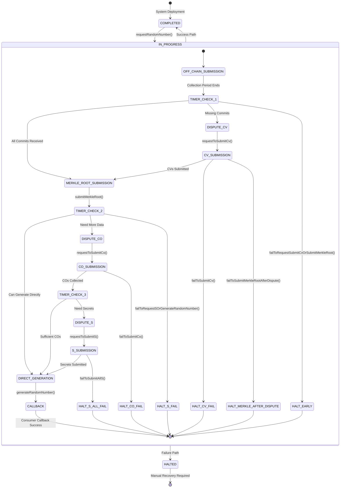
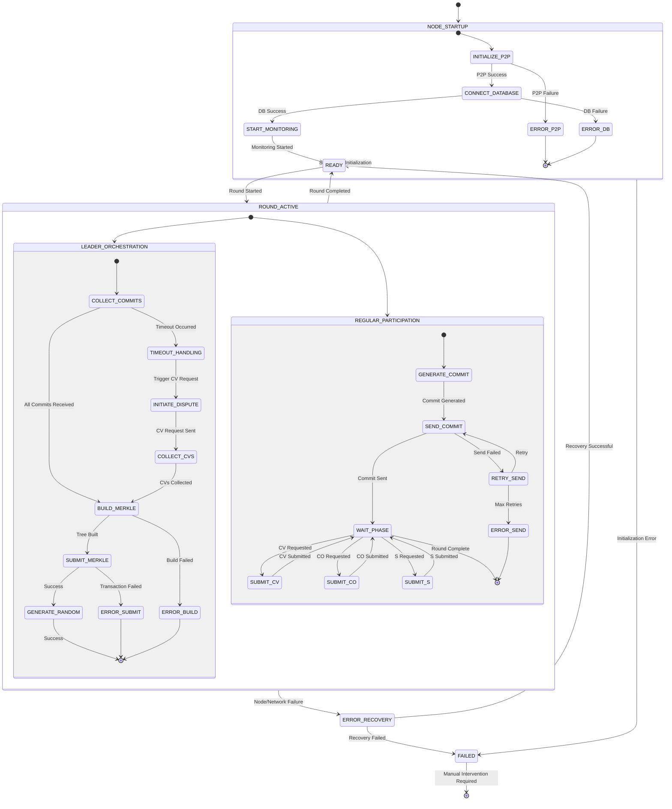
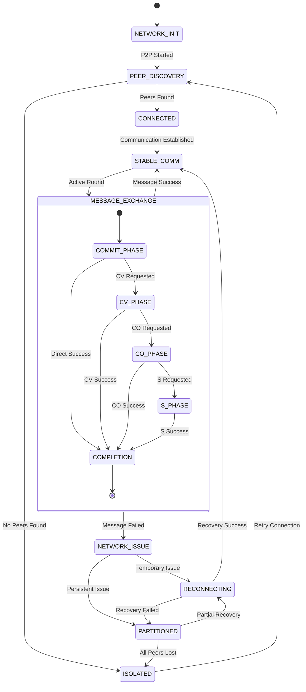
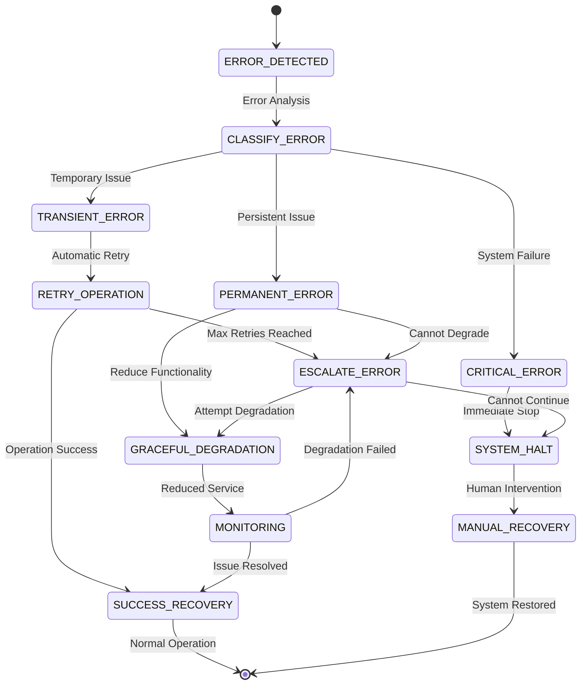

# DRB System State Diagram

## System State Flow (Corrected Based on Official Diagram)

## Backend Node State Flow

## Network Communication State Flow

## Error Recovery Flow

## Legend

### State Types
- **🟢 Success States**: Normal operation paths
- **🟡 Warning States**: Degraded operation or retry scenarios  
- **🔴 Error States**: Failure states requiring intervention
- **⭕ Terminal States**: End states requiring restart/recovery

### Transition Types
- **Solid Lines**: Normal flow transitions
- **Dashed Lines**: Error/exception transitions
- **Dotted Lines**: Recovery/retry transitions

### Coverage Status
- **✅ Tested**: State and transitions have test coverage
- **⚠️ Partial**: Some aspects tested, gaps exist
- **❌ Missing**: No test coverage for state/transition